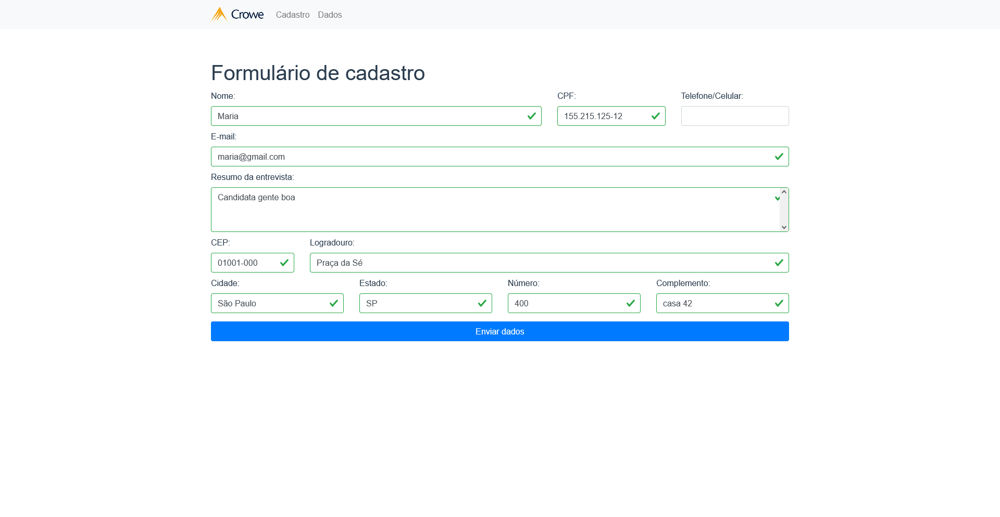
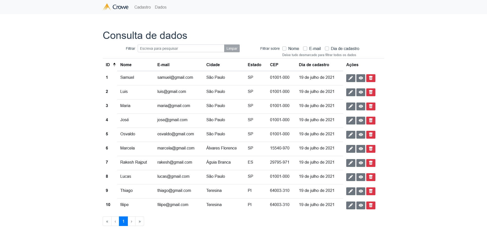

# crowe-web

[🇧🇷 - Português brasileiro](./README.md)

Crowe's challenge to applicants. Web.

Crowe is starting a new selection process and requested the Technology sector to create a form to register the candidates that will participate in this selection process.

This repo stores the project's front-end. Download and install the [crowe-api](https://github.com/samuel-s-marques/crowe-api) project to use the back-end.

<!--ts-->
- [crowe-web](#crowe-web)
	- [Images](#images)
	- [Features](#features)
	- [Technologies](#technologies)
	- [TODO](#todo)
	- [How to use](#how-to-use)
		- [Requirements](#requirements)
		- [Running the front-end (client)](#running-the-front-end-client)
		- [Running the back-end (server)](#running-the-back-end-server)
	- [License](#license)
<!--te-->

## Images
|  Registration | Data table | Applicants visualization | Confirm deletion 
|:-----------------:|:---------------:|:-----------------:|:---------------:|
|  |  |  | 

## Features
- [ ] Registration of applicants
- [ ] Listing of Applicants
- [ ] Applicant deletion
- [ ] Editing applicants

## Technologies
- [ ] [Vue.js](https://vuejs.org/)
- [ ] [Axios](https://github.com/axios/axios)
- [ ] [BootstrapVue](https://bootstrap-vue.org/)
- [ ] [Vue-The-Mask](https://github.com/vuejs-tips/vue-the-mask)
- [ ] [VeeValidate](https://vee-validate.logaretm.com/v3/)

## TODO
- [x] Registration
  - [x] Add CPF
  - [x] CPF validation
- [x] Listing
  - [x] Pagination
  - [x] Sorting
  - [x] Search bar
- [x] Deletion
  - [x] Confirm deletion
- [x] Visualization
- [x] Editing
- [x] Validating
- [x] /404
- [x] Routes
- [x] [ViaCep](https://viacep.com.br/) API

## How to use
We can consider this project divided into two parts:
1. Front-end (this repo)
2. Back-end ([crowe-api](https://github.com/samuel-s-marques/crowe-api))

The front-end needs the back-end to be running in order to work.

### Requirements
Before beginning, you'll need to have installed in your machine [Git](https://git-scm.com) and [Node.js](https://nodejs.org/en/).

### Running the front-end (client)
Download this repo (you will need to extract the files), clicking [here](https://github.com/samuel-s-marques/crowe-web/archive/refs/heads/master.zip) or cloning:

```bash
$ git clone https://github.com/samuel-s-marques/crowe-web
```

Access the project's folder in your cmd/terminal
```bash
$ cd crowe-web
```

Install the dependencies using **npm install**
```bash
$ npm install
```

Execute the app in development mode
```bash
$ npm run serve
```

The client will start on port :8080 - access [http://localhost:8080](http://localhost:8080).

-----

### Running the back-end (server)

Download the back-end's repo (you will need to extract the files), clicking [here](https://github.com/samuel-s-marques/crowe-api/archive/refs/heads/master.zip) or cloning:

```bash
$ git clone https://github.com/samuel-s-marques/crowe-api
```

Access the project's folder in your cmd/terminal
```bash
$ cd crowe-api
```

Install the dependencies using **npm install**
```bash
$ npm install
```

Define the settings in the .env.example file. To get the value of the APP_KEY key, you will have to generate it through
```bash
$ node ace generate:key
```

After generating it, copy the 

After generating, copy the given value and paste it into the APP_KEY key of the .env.example.
```cl
PORT=3333
HOST=0.0.0.0
NODE_ENV=development
APP_KEY=**paste here!**
DB_CONNECTION=sqlite
```
And then remove the .example suffix from the file.

Run the application in development mode
```bash
$ npm run dev
```

The server will start on port :3333.

## License
This project is under the MIT license. See the [LICENSE](LICENSE) file for more details.