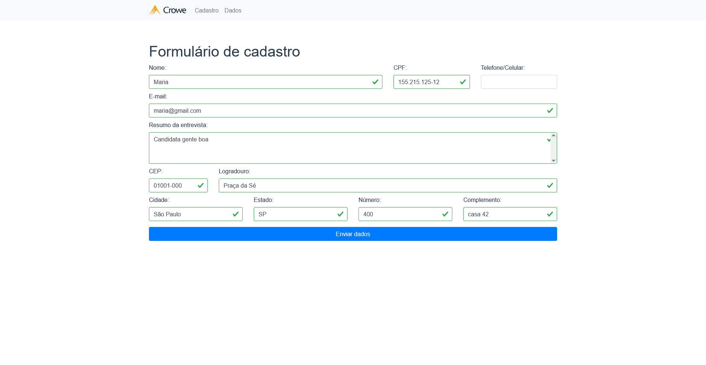
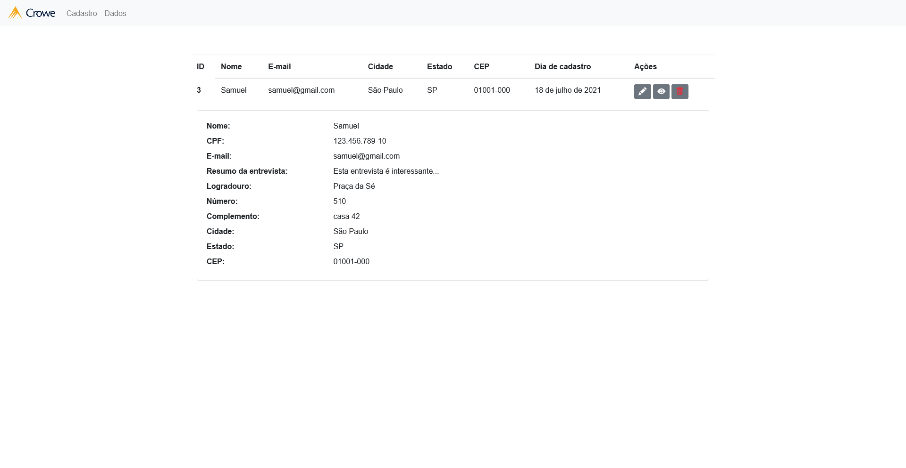
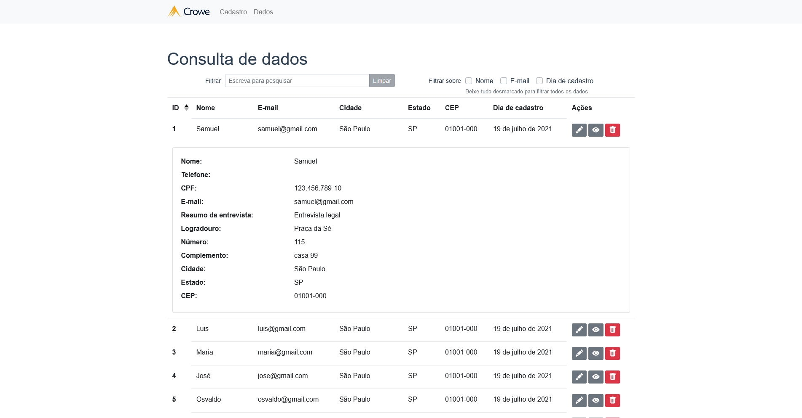
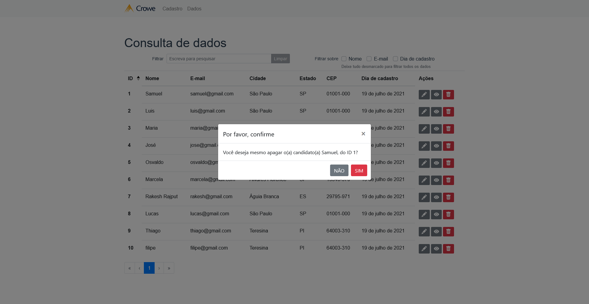

# crowe-web

[🇬🇧 - English](./README.en.md)

Desafio da Crowe para candidatos. Interface Web.

A Crowe está iniciando um novo processo seletivo e solicitou ao setor de Tecnologia a criação de um formulário para cadastrar os candidatos que participarem desse processo seletivo.

Este repositório guarda o front-end do projeto. Baixe e instale o projeto [crowe-api](https://github.com/samuel-s-marques/crowe-api) para ter acesso ao back-end.

<!--ts-->
- [crowe-web](#crowe-web)
	- [Imagens](#imagens)
	- [Features](#features)
	- [Tecnologias](#tecnologias)
	- [TODO](#todo)
	- [Como usar](#como-usar)
		- [Pré requisitos](#pré-requisitos)
		- [Rodando o front-end (cliente)](#rodando-o-front-end-cliente)
		- [Rodando o back-end (servidor)](#rodando-o-back-end-servidor)
	- [Licença](#licença)
<!--te-->

## Imagens
| Cadastro de dados | Tabela de dados | Visualização do candidato | Confirmação de exclusão 
|:-----------------:|:---------------:|:-----------------:|:---------------:|
|  |  |  | 

## Features
- [ ] Cadastro de candidatos
- [ ] Listagem de candidatos
- [ ] Exclusão de candidatos
- [ ] Edição de candidatos

## Tecnologias
- [ ] [Vue.js](https://vuejs.org/)
- [ ] [Axios](https://github.com/axios/axios)
- [ ] [BootstrapVue](https://bootstrap-vue.org/)
- [ ] [Vue-The-Mask](https://github.com/vuejs-tips/vue-the-mask)
- [ ] [VeeValidate](https://vee-validate.logaretm.com/v3/)

## TODO
- [x] Cadastro
  - [x] Adicionar CPF
  - [x] Validar CPF
- [x] Listagem
  - [x] Paginação
  - [x] Sorteável
  - [x] Barra de pesquisa
- [x] Exclusão
  - [x] Confirmar exclusão
- [x] Exibição
- [x] Edição
- [x] Validações
- [x] /404
- [x] Rotas
- [x] API [ViaCep](https://viacep.com.br/)

## Como usar
Podemos considerar que este projeto está dividido em duas partes:
1. Front-end (este repositório)
2. Back-end ([crowe-api](https://github.com/samuel-s-marques/crowe-api))

O front-end precisa que o back-end esteja sendo executado para funcionar.

### Pré requisitos
Antes de começar, você vai precisar ter instalado em sua máquina o [Git](https://git-scm.com) e [Node.js](https://nodejs.org/en/).

### Rodando o front-end (cliente)

Baixe este repositório (necessário extrair os arquivos), seja clicando [aqui](https://github.com/samuel-s-marques/crowe-web/archive/refs/heads/master.zip) ou clonando com:

```bash
$ git clone https://github.com/samuel-s-marques/crowe-web
```

Acesse a pasta do projeto no terminal/cmd
```bash
$ cd crowe-web
```

Instale as dependências com **npm install**
```bash
$ npm install
```

Execute a aplicação em modo de desenvolvimento
```bash
$ npm run serve
```
O cliente iniciará na porta :8080 - acesse [http://localhost:8080](http://localhost:8080).

-----

### Rodando o back-end (servidor)

Baixe o repositório do back-end (necessário extrair os arquivos), seja clicando [aqui](https://github.com/samuel-s-marques/crowe-api/archive/refs/heads/master.zip) ou clonando com:

```bash
$ git clone https://github.com/samuel-s-marques/crowe-api
```

Acesse a pasta do projeto no terminal/cmd
```bash
$ cd crowe-api
```

Instale as dependências com **npm install**
```bash
$ npm install
```

Defina no arquivo .env.example as configurações. Para obter o valor da chave APP_KEY, você terá de gerar através do comando
```bash
$ node ace generate:key
```
Após gerar, copie o valor dado e cole na chave APP_KEY, do .env.example.
```cl
PORT=3333
HOST=0.0.0.0
NODE_ENV=development
APP_KEY=**Cole aqui!**
DB_CONNECTION=sqlite
```
E, então, remova o sufixo .example do arquivo.

Execute a aplicação em modo de desenvolvimento
```bash
$ npm run dev
```

O servidor iniciará na porta :3333.

## Licença
Esse projeto está sob a licença MIT. Veja o arquivo [LICENSE](LICENSE) para mais detalhes.